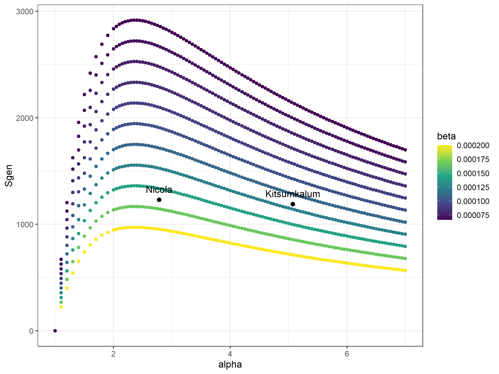

```{r setup, include=FALSE}
knitr::opts_chunk$set(echo = TRUE)
```

## Context

Many salmon populations are at historic lows abundance. 

* Recent downward trends of low productivity, smolt to adult survival, body size, age at return, eggs
* Increasing number of threatened and endangered populations. 
* Unfavourable conditions for BC salmon: 
  * Recent past: ocean (rapid ocean warming; Cheng et al. 2021) and freshwater (floods, heat dome)
  * Projected based on climate change

Current policy relies on status, usually compares abundance of spawners to a benchmark. Benchmarks can be based on estimated model parameters (e.g., $S_{gen}$)  or a percentile of recorded abundance. Can also be based on multiple metrics such as short and long term trends and distribution (e.g., integrated status assessments, Salmon Scanner).

Assumptions of benchmarks from model parameters:

* Alpha and beta reflect 'true' characteristics of population *and climate and ecosystem conditions that are implicit in observations of recruitment* in current and future states
* Given number of spawners will result in a given number of recruits, i.e., no low productivity years or black swan events
* Uses alpha and beta from full time series, ignoring recent trends in recruits per spawner (which could be < 1, i.e., below replacement)
* No harvest (sometimes)
* Spawners at maximum sustainable yield ($SMSY$) is an appropriate target for the population (relies on population actually behaving according to alpha and beta parameters, not on actual survival rates observed, especially in recent years)

Problematic examples: 

* $S_{gen}$ benchmark when actual recruits per spawner is below alpha and replacement (especially for multiple years)
* $S_{gen}$ benchmark when alpha > 2.5 (Fig. \ref(fig:Sgen-alpha))
* $S_{gen}$ benchmark when there is harvest


```{r Sgen-alpha, fig.cap="Sgen values for given combinations of alpha and beta for a Ricker model", echo=FALSE}

```

## Problems with fixed escapement goals combined with low and variable productivity

If fixed escapement goals are set based on alpha and beta values from historic observations only, and do not account for actual observations of recruits-per-spawner (or $R/S$) $\leq$ 1:

* Management that allows harvest of 'surplus' fish down to $S_{gen}$ or even $SMSY$, combined with variable $R/S$ including values < 1 (or values > 1 combined with harvest rates that result in actual $R/S$ < 1), over time, combined with years where escapement goal is not reached due to poor returns and $R/S$ < 1, will result in population decline. 

In this scenario of variable $R/S$ including $R/S$ < 1 (after accounting for harvest), the so-called surplus fish are actually needed to cover for subsequent and/or past years of $R/S$ < 1. Because of the overlapping generations and variable age at return, these boom years are necessary to ensure the population does not spiral to collapse. 

## Potential solutions

Two potential solutions to these problems:

* Set fixed escapement goal higher to account for cycles of low productivity, and use information from observed $R/S$, fecundity, etc., instead of just on model parameters alpha and beta and benchmarks derived from them.
* Set escapement goals that vary (rule-based categorical and/or scaling) depending on various metrics, e.g.:
  * abundance of returns
  * declining body size and/or fecundity
  * risk of low productivity for future cohorts (e.g., habitat conditions such as unstable rivers, cumulative effects, climate change predictions for ocean and freshwater). In other words, if $R/S$ for future cohorts is expected to be <1, you need to 'bank' adult fish in the ocean for future spawning years that will have recruitment below replacement
  * past low recruitment years (to make up for low number of returning adults in subsequent years)

Tools to account for low and/or variable $R/S$ for implementing the two options above: 

* Use life cycle models based on fecundity and survival rates (e.g., spawner to egg, egg to fry/smolt, smolt to adult) paired with recent and projected body size and fecundity data. Could be used in combination
* Using simulation modeling based on actual observations of $R/S$, trends in fecundity, body size, harvest etc.
* Incorporate risk tolerance based on climate change predictions for ocean and freshwater conditions (precautionary)
 
